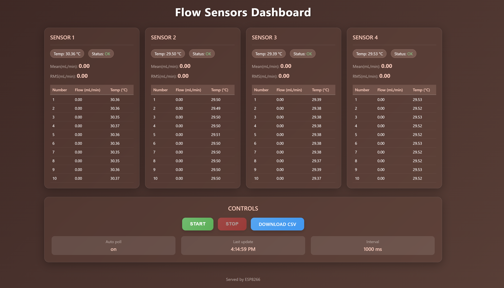

# ESP8266 Flow Sensor Monitor (4-Sensor System)

A real-time flow sensor monitoring system using ESP8266 with web-based dashboard for measuring and recording liquid flow rates from up to four SLF3X sensors simultaneously.



## Features

- **Quad Sensor Support**: Monitor up to four SLF3X flow sensors simultaneously
- **Real-time Monitoring**: 20Hz sampling rate with live web dashboard
- **Statistical Analysis**: Real-time calculation of mean, RMS, and coefficient of variation (CV)
- **Data Recording**: Record measurements to CSV files with 0.5-second intervals
- **Web Interface**: Modern glassmorphism-themed dashboard accessible from any device
- **WiFi Connectivity**: Remote monitoring via WiFi connection
- **I2C Multiplexer**: Uses TCA9548A for managing multiple sensors on same I2C bus
- **Smart Memory Management**: Automatic storage monitoring and protection

## Use Cases

### Flow Control Systems with PID Feedback
This monitoring system is ideal for implementing closed-loop flow control systems:

- **PID Controller Integration**: Real-time flow data can be fed into PID controllers to maintain stable flow rates
- **Motor Speed Control**: Adjust pump or motor RPMs based on flow feedback to achieve target flow rates
- **Multi-Point Control**: Monitor multiple flow points in complex systems (inlet, outlet, bypass flows)
- **Disturbance Rejection**: Quickly detect and compensate for flow disturbances or pressure variations
- **System Optimization**: Use statistical data (mean, RMS, CV) to tune PID parameters and improve system stability
- **Process Monitoring**: Track flow stability over time and identify system performance trends

**Example Applications**:
- Chemical dosing systems with precise flow control
- HVAC systems with variable flow requirements
- Laboratory equipment requiring stable fluid delivery
- Industrial processes with multiple flow control points
- Irrigation systems with feedback-controlled flow rates

## Hardware Requirements

### Components
- ESP8266 development board (NodeMCU, Wemos D1 Mini, etc.)
- Up to 4x SLF3X flow sensors (Sensirion)
- 1x TCA9548A I2C multiplexer (required for multiple sensors)
- Breadboard and jumper wires

### Pin Connections

#### ESP8266 to TCA9548A (I2C Multiplexer)
| ESP8266 Pin | TCA9548A Pin | Description |
|-------------|--------------|-------------|
| D1 (GPIO5)  | SCL          | I2C Clock   |
| D2 (GPIO4)  | SDA          | I2C Data    |
| 3.3V        | VCC          | Power       |
| GND         | GND          | Ground      |

#### TCA9548A to Flow Sensors
| TCA9548A Channel | Sensor | SLF3X Pin | Description |
|------------------|--------|-----------|-------------|
| Channel 0        | Sensor 1| SCL/SDA  | I2C Bus     |
| Channel 1        | Sensor 2| SCL/SDA  | I2C Bus     |
| Channel 2        | Sensor 3| SCL/SDA  | I2C Bus     |
| Channel 3        | Sensor 4| SCL/SDA  | I2C Bus     |

#### Power Connections
- Connect 3.3V and GND to all flow sensors
- Each sensor requires 3.3V power supply
- Ensure adequate current capacity for multiple sensors

### Sensor Configuration
The system supports 1-4 sensors. You can:
- Install fewer than 4 sensors (system will auto-detect)
- Monitor multiple flow points simultaneously for comprehensive flow analysis

## Software Setup

### 1. Arduino IDE Configuration
1. Install ESP8266 board package in Arduino IDE
2. Install required libraries:
   - ESP8266WiFi
   - ESP8266mDNS
   - LittleFS

### 2. Configure WiFi Settings
Edit the following lines in `FlowSensor_UI_ESP8266_V2/FlowSensor_UI_ESP8266/FlowSensor_UI_ESP8266.ino`:
```cpp
const char* WIFI_SSID = "YOUR_WIFI_NAME";     // Replace with your WiFi network name
const char* WIFI_PASS = "YOUR_WIFI_PASSWORD"; // Replace with your WiFi password
const char* MDNS_HOST = "flowsensor";          // Optional: Change hostname
```

### 3. Upload Code
1. Connect ESP8266 to computer via USB
2. Select correct board and port in Arduino IDE
3. Upload `FlowSensor_UI_ESP8266_V2/FlowSensor_UI_ESP8266/FlowSensor_UI_ESP8266.ino`

### 4. Hardware Configuration
Verify pin assignments in `FlowSensor_UI_ESP8266_V2/FlowSensor_UI_ESP8266/sensors.h`:
```cpp
#define SDA_PIN        4          // ESP8266 D2
#define SCL_PIN        5          // ESP8266 D1
#define TCA_ADDR       0x70       // TCA9548A I2C address
#define NUM_SENSORS    4          // Using MUX channels 0, 1, 2, 3
#define SLF3X_ADDR     0x08       // All sensors share the same address
```

## Usage

### 1. Power On and Connect
1. Power the ESP8266 via USB or external supply
2. Monitor serial output (115200 baud) for connection status
3. Note the IP address displayed in serial monitor

### 2. Access Web Dashboard
- **Local IP**: Open browser to the IP address shown in serial monitor
- **mDNS** (if supported): `http://flowssensors.local` (or your custom hostname)

### 3. Web Interface Functions

#### Real-time Display
- **Sensor Cards**: Individual cards for each of the 4 sensors with glassmorphism design
- **Sensor Status**: Shows "OK" or "ERROR" for each sensor
- **Live Measurements**: 
  - 1-second averaged flow rate (mL/min)
  - Temperature (°C)
- **10-second Statistics**:
  - Mean flow rate over 10 seconds
  - RMS (Root Mean Square) value
  - CV (Coefficient of Variation) as percentage
- **Rolling History**: Last 10 measurements displayed in tables for each sensor

#### Recording Controls
- **Start Button**: Begin recording measurements to CSV file
- **Stop Button**: End recording session
- **Download CSV**: Download recorded data (appears after stopping)

### 4. Data Recording and Download

#### Recording Process
1. Click "Start" to begin recording
2. System records averaged measurements every 0.5 seconds
3. Click "Stop" to end recording
4. "Download CSV" button appears when data is ready

#### CSV Format
Downloaded files contain data for all 4 sensors:
```csv
time_s,s1_flow_ml_min,s1_temp_c,s2_flow_ml_min,s2_temp_c,s3_flow_ml_min,s3_temp_c,s4_flow_ml_min,s4_temp_c
0.0,12.345,23.45,15.678,24.12,11.234,22.89,16.789,24.56
0.5,12.289,23.47,15.723,24.15,11.189,22.91,16.834,24.58
...
```

Columns:
- `time_s`: Time in seconds from recording start
- `s[1-4]_flow_ml_min`: Sensor flow rate (mL/min)
- `s[1-4]_temp_c`: Sensor temperature (°C)

## Memory Management

The V2 system includes intelligent memory management to prevent storage overflow and ensure reliable operation:

### Automatic Storage Monitoring
- **Storage Check**: System monitors LittleFS usage before and during recording
- **Threshold Protection**: Automatically prevents recording when storage exceeds 90% capacity
- **Periodic Monitoring**: Storage levels checked every 10 seconds during recording
- **Graceful Degradation**: Recording stops automatically if storage becomes full

### Storage Optimization Features
- **Efficient Data Format**: Optimized CSV format with appropriate precision
- **File Management**: Previous recordings are overwritten to prevent accumulation

### Storage Information
- **File System**: Uses LittleFS (Little File System) for reliable flash storage
- **Capacity**: Typically 1-3MB depending on ESP8266 module
- **File Location**: CSV files stored as `/last_run.csv` in flash memory
- **Access Method**: Files downloadable via web interface

### Memory Usage Guidelines
- **Estimated Storage**: ~1KB per minute of 4-sensor recording (approximate)
- **Maximum Recording Time**: Depends on available flash space and number of active sensors
- **Best Practice**: Download and clear recordings regularly for long-term monitoring

## Technical Specifications

- **Sensor Capacity**: Up to 4 SLF3X flow sensors
- **Sampling Rate**: 20 Hz continuous monitoring per sensor
- **Recording Rate**: 0.5-second averages when recording
- **Flow Range**: Dependent on SLF3X sensor model
- **Temperature Range**: Dependent on SLF3X sensor specifications
- **Data Storage**: Local flash memory (LittleFS) with automatic management
- **Network**: WiFi 802.11 b/g/n
- **Web Server**: HTTP on port 80
- **I2C Speed**: 400 kHz for optimal sensor communication
- **Memory Protection**: Automatic storage monitoring and overflow prevention

## Troubleshooting

### Common Issues

1. **Sensors show "ERROR" status**
   - Check I2C wiring connections
   - Verify sensor power (3.3V)
   - Confirm TCA9548A configuration
   - Check individual sensor connections and I2C addresses

2. **Cannot connect to WiFi**
   - Verify SSID and password in code
   - Check WiFi signal strength
   - Ensure 2.4GHz network (ESP8266 doesn't support 5GHz)

3. **Web interface not accessible**
   - Check serial monitor for IP address
   - Verify device is on same network
   - Try direct IP access instead of mDNS (`flowssensors.local`)

4. **CSV download fails or recording won't start**
   - Check available flash memory via serial monitor
   - Storage warnings indicate >90% usage
   - Download existing data and restart device to clear memory
   - Disable unused sensors to reduce storage requirements

5. **Memory/Storage Issues**
   - Monitor serial output for storage warnings
   - System automatically stops recording at 90% capacity
   - Download CSV files regularly to free up space
   - Consider recording duration based on available storage

### Serial Monitor Output
Monitor the serial output for diagnostic information:
- WiFi connection status and IP address
- Sensor initialization status
- Recording start/stop events
- HTTP server status
- **Storage monitoring**: Usage warnings and capacity alerts
- **Sensor status**: Individual sensor communication status

## License

This project is open source and available for modification and distribution.

## Contributing

Feel free to submit issues, fork the repository, and create pull requests for any improvements.